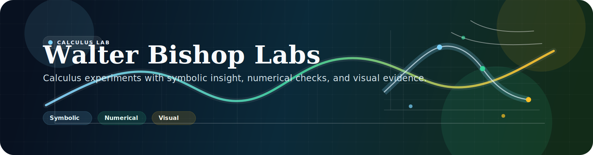

# 🧪 Walter Bishop Labs: Calculus Experiments

> *"Calculus is not a subject you learn. It is a tool you develop."*


---

## What This Repository Is

This is my calculus lab: a set of experiments that turn derivatives, optimization, integration, and Fourier series into something you can inspect, plot, compare, and explain.

I built it to move calculus out of the "solve and forget" zone and into a workflow that feels closer to engineering, data analysis, and scientific reasoning.

## What To Expect

Expect a steady experiment-by-experiment progression, a mix of symbolic math and numerical verification, and plots plus reports that focus on behavior instead of only final answers. The writing is aimed at readers who want both intuition and technical confidence.

If you skim only one part of this README, make it the sections below. They explain the value of the repo quickly and then show how the experiments fit together.

---

## Why Calculus Still Matters

If you use modern technology, you are already surrounded by calculus.

Machine learning depends on optimization, robotics and control systems rely on derivatives for motion and stability, computer graphics and simulation use smooth curves and gradients, and economics or operations often come down to marginal change and sensitivity. Product decisions use the same mindset whenever the question becomes, *"what happens if this input changes a little?"* So this repo is not about old math for old classrooms. It is about the mathematical engine behind modern decision systems.

---

## How I Use Experiments

In class, we often see the final result first.
In real work, we care about the *process* and *reliability* of that result.

This project turns calculus into an experimental workflow:

1. Start with a function and assumptions.
2. Derive symbolic truths (exact derivatives, critical points, constraints).
3. Probe behavior numerically across ranges.
4. Visualize what the equations are really saying.
5. Check robustness when assumptions shift.
6. Convert math into decisions and interpretation.

The goal is to answer not just *"what is the answer?"* but also why that answer happens, when it fails, and how much trust it deserves.

---

## Why This Is Useful

Yes. The experiments are academic in foundation, but practical in purpose.

They train the habit of turning abstract derivatives into explainable behavior, comparing symbolic and numerical methods as one analysis pipeline, making optimization choices under constraints, stress-testing recommendations through sensitivity and robustness checks, and writing results in a way a lecturer, teammate, or reviewer can audit. This is the same mindset used in analytics, ML tuning, engineering optimization, and quantitative modeling.

---

## Reading Path

If you want the fastest route through the repo, start here:

1. Read this README for the big picture.
2. Open [experiment_structure.md](experiment_structure.md) for the map of the project.
3. Use [BRIDGE_EXPERIMENTS_01_TO_02.md](BRIDGE_EXPERIMENTS_01_TO_02.md) to see how the first experiments connect.
4. Dive into the experiment READMEs in order if you want the full progression.

---

## What Makes This Repository Different

Many calculus examples online are *"single-shot"*: compute answer, move on.

This repository is deliberately different:

| Principle | What it means |
|---|---|
| Experiment-driven | Not answer-driven — the process is the product |
| Hybrid methods | Symbolic math and numerical evidence in one workflow |
| Interpretation-first | Results explained, not just computed |
| Structured documentation | Validation and writeups, not just scripts |
| Student voice | Built accessibly, organized for serious technical readers |

In short: this repo treats calculus as a lab, not a checklist.

---

## Experiments

> The sequence is intentional: **local change → optimal decision points → accumulated system impact**

| Stage | What changes | What you learn |
|---|---|---|
| 01 | Single-function behavior | How derivatives reveal shape, turning points, and local structure |
| 02 | Optimization under constraints | How to choose better operating points and test sensitivity |
| 03 | Accumulated effect | How integration turns rate signals into totals |
| 04 | Periodic reconstruction | How Fourier series rebuild signals from harmonics |
| 05 | Convergence behavior | How recursive systems and partial sums settle or diverge |
| 06 | Parameter sensitivity | How coefficient scaling changes reconstruction quality |

| # | Experiment | Focus |
|---|---|---|
| 01 | [Function Behavior Analysis](experiments/experiment_01_function_behavior_analysis) | Deep dive into one function using derivatives and visual behavior |
| 02 | [Optimisation and Sensitivity Analysis](experiments/experiment_02_optimisation_and_sensitivity_analysis) | Extends analysis into optimization, constraints, and robustness |
| 03 | [Integral Calculus](experiments/experiment_03_integral_calculus) | Integration as a modern applied experiment for estimating totals from sampled or modelled rate signals |
| 04 | [Fourier Series Reconstruction](experiments/experiment_04_fourier_series_reconstruction) | Reconstructs periodic signals using Fourier partial sums and tracks approximation quality |
| 05 | [Series and Sequence Convergence Applications](experiments/experiment_05_series_sequence_convergence_applications) | Practical convergence/divergence analysis with recursive systems, partial sums, and animated behavior |
| 06 | [Fourier Series Parameter Sensitivity](experiments/experiment_06_fourier_series_parameter_sensitivity) | Studies Fourier series coefficient scaling, amplitude changes, and harmonic-count sensitivity through graphs and animations |

---

## In Plain Terms

If you are wondering whether this repo is worth your time, here is the short answer:

It shows how calculus behaves, not just what the final formula is. It helps you connect theory to plots, code, and interpretation. It is organized like a learning journey, so each experiment adds something new. It is meant to be useful for students, lecturers, and anyone who wants the math to feel less abstract.

## Repository Layout

```
.
├── README.md
├── experiment_structure.md
├── BRIDGE_EXPERIMENTS_01_TO_02.md
├── run_experiments.py
├── requirements.txt
└── experiments/
    ├── experiment_01_function_behavior_analysis/
    ├── experiment_02_optimisation_and_sensitivity_analysis/
    ├── experiment_03_integral_calculus/
    ├── experiment_04_fourier_series_reconstruction/
    ├── experiment_05_series_sequence_convergence_applications/
    └── experiment_06_fourier_series_parameter_sensitivity/
```

**Recommended read path:**

1. [README.md](README.md)
2. [experiment_structure.md](experiment_structure.md)
3. [BRIDGE_EXPERIMENTS_01_TO_02.md](BRIDGE_EXPERIMENTS_01_TO_02.md)
4. [Experiment 01 README](experiments/experiment_01_function_behavior_analysis/README.md)
5. [Experiment 02 README](experiments/experiment_02_optimisation_and_sensitivity_analysis/README.md)
6. [Experiment 03 README](experiments/experiment_03_integral_calculus/README.md)
7. [Experiment 04 README](experiments/experiment_04_fourier_series_reconstruction/README.md)
8. [Experiment 05 README](experiments/experiment_05_series_sequence_convergence_applications/README.md)
9. [Experiment 06 README](experiments/experiment_06_fourier_series_parameter_sensitivity/README.md)

---

## Quick Start

```bash
# Install dependencies
pip install -r requirements.txt

# Run Experiment 01
python run_experiments.py --exp 1

# Run Experiment 02
python run_experiments.py --exp 2

# Run Experiment 03 (direct entry)
python experiments/experiment_03_integral_calculus/main.py

# Run Experiment 04 (direct entry)
python experiments/experiment_04_fourier_series_reconstruction/main.py

# Run Experiment 05 (direct entry)
python experiments/experiment_05_series_sequence_convergence_applications/main.py

# Run Experiment 06 (direct entry)
python experiments/experiment_06_fourier_series_parameter_sensitivity/main.py

# Run both (01 and 02)
python run_experiments.py --exp both

# Run all experiments (01 to 06)
python run_experiments.py --exp all

# Run validation only (no plots)
python run_experiments.py --validate
```

> All commands are run from the repository root.

---

## Technical Approach

This project intentionally combines two complementary methods:

| Method | Tool | Purpose |
|---|---|---|
| Symbolic computation | SymPy | Exact derivatives, candidate discovery, transparent algebra |
| Numerical computation | NumPy / Matplotlib | Sampling, plotting, behavior verification, and visual intuition |

This hybrid approach avoids two common traps:

Pure symbolic work can be hard to intuit, while pure numerical work can be hard to justify mathematically.

---

## Learning Outcomes

After running these experiments, I should be able to:

Interpret $f'(x)$ and $f''(x)$ computationally and geometrically, link critical points to actual curve behavior and decision implications, compare optimization methods clearly, discuss sensitivity and robustness in plain practical language, and produce reports that are mathematically sound and readable.

---

## Quality and Limitations

This project prioritizes **conceptual clarity first**, then engineering maturity.

Current limitations (explicitly documented so scope and confidence are clear):

The current scope is mostly 1D objective-function analysis, some assumptions may not generalize to non-smooth functions, certain parameter choices are still manually tuned, and reporting plus test depth are improving but not exhaustive yet.

---

## Contributing

Contributions are welcome if they improve calculus interpretation and clarity, mathematical or code correctness, or output explainability and reproducibility.

Please keep contributions **educational, practical, and technically grounded**.

---

## License

This repository uses the **MIT License**. See [LICENSE](LICENSE).

---

<p align="center">Built with curiosity. Verified with evidence. Explained with intention.</p>
